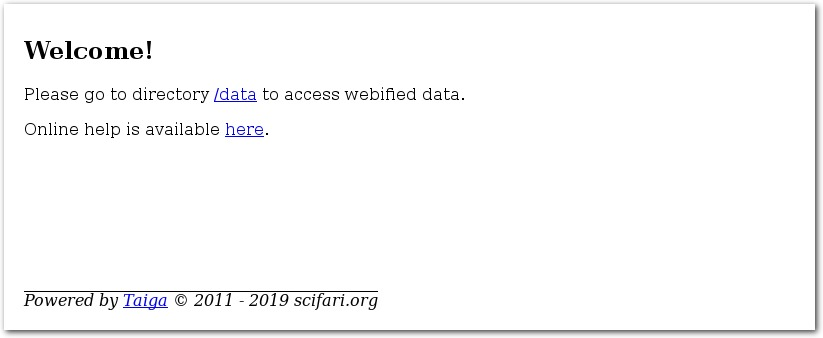
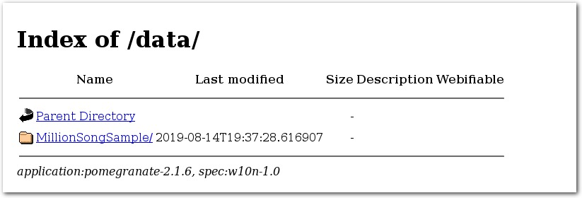
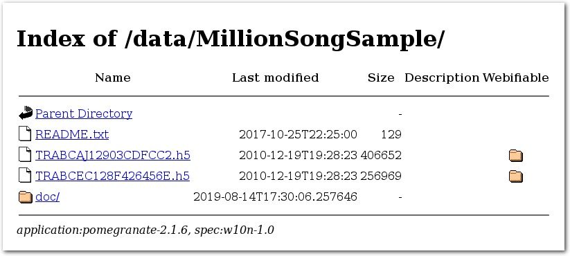
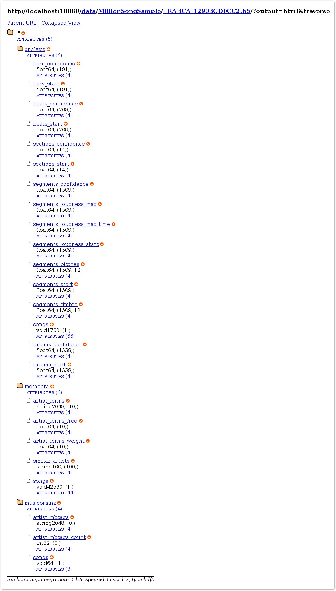
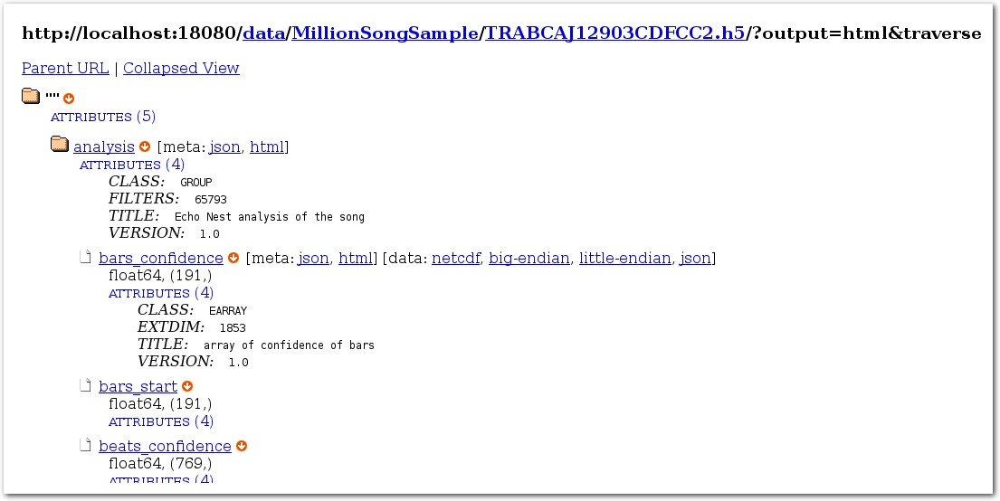
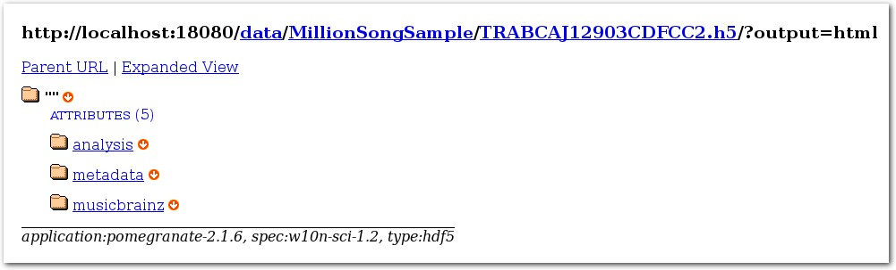

# Taiga

## Introduction

Taiga is a web application server that bundles Webification (w10n) software packages, such as [Pomegranate](https://github.com/scifari/pomegranate), for easy and efficient use of large and complex data in various formats (e.g., HDF4/5 and NetCDF, etc.)

## Installation

### Use docker image
The easiest way to install Taiga is to use a docker image, which is available at

https://hub.docker.com/r/scifari/taiga

### Use release tar ball

On CentOS or similar Linux distributions, you can check out or download most recent release from

https://github.com/scifari/taiga/tree/master/release

then install and configure as, e.g.,

```
$ mkdir  ./tool
$ cd ./tool
$ wget https://raw.githubusercontent.com/scifari/taiga/master/release/taiga-2.0.4p8-linux-x86_64.centos-7.5.1804-a.tar.gz
$ tar zxf ./taiga-2.0.4p8-linux-x86_64.centos-7.5.1804-a.tar.gz
$ ./taiga-2.0.4p8-linux-x86_64.centos-7.5.1804-a/bin/taiga-service config --port ${myPort} --dataDirectory ${myDataDirectory}
$ ./taiga-2.0.4p8-linux-x86_64.centos-7.5.1804-a/bin/taiga-service start -f 9
```
where `${myPort}` and `${myDataDirectory}` must be replaced by real values.

## Quick Start

Installed with Taiga is a simple html-based GUI.
One can use it to quickly browse through w10n entities
(directories and groups as nodes, files and arrays as leaves, etc.)

Shown below are screenshots that illustrate this simple GUI,
using MillionSoundSample as an example. Please check [this doc](./doc)
for instruction of loading MillionSoundSample tarball to Taiga.

Assuming Taiga is started on port `18080` of `localhost`, point browser to
`http://localhost:18080`, one should be able to see a `Welcome` page:



Click on link `/data`, a page with a list of directories will be shown
and one directory is `MillionSongSample`:



Click on link `MillionSongSample`, another page with multiple HDF5 files
(with extension `.h5`) and a directory named `doc` will be shown.
On this page, each HDF5 file is marked as *Webifiable*,
by a folder icon  at rightmost column.



Pick one HDF5 file and click on its corresponding folder icon
 in "Webifiable" column.
Its link will lead to a new page, showing *internals* of the HDF5 file.
By default, all w10n entities (node and leaf) will be shown in a tree
with levels properly indented.



On this page, a w10n node is visually identifiable
by folder icon ,
and a w10n leaf by file icon .
For either w10n node or leaf,
a "toggleble" download icon 
is displayed to its right side, providing links for direct access of `meta` info
in JSON & HTML and `data` info in JSON, big/little endian binary and other formats.
There is also a *toggleable* blue string "ATTRIBUTES",
below the name of a node or leaf, that one can click on
to show/hide attributes of the w10n entity.
Value inside a pair of parenthesis is the number of attributes.

Furthermore, for a w10n leaf,
information about array type, dimension and size
is also displayed.



By default, the entire tree is traversed.
One can toggle a clickable string (Expanded View/Collapsed View) at page top next to "Parent" link
to display the tree in one level or all levels.



Though this simple html-based GUI is convenient for exploring w10n entities,
it does not demonstrate the full power of w10n. Please read 
[Use w10n store](./doc/w10n.md) and [Use w10n-sci store](./doc/w10n-sci.md)
